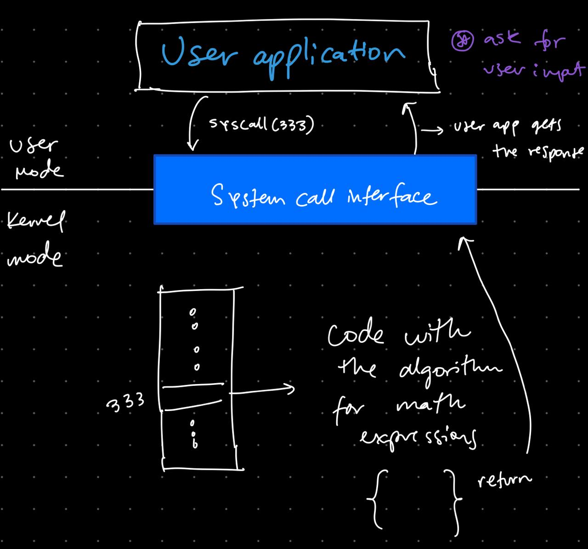
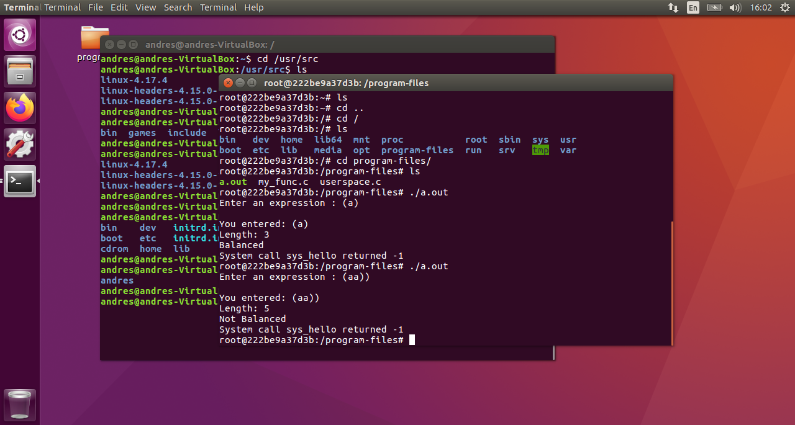

# SysCall
Syscall project 

## Comando para correrlo

```bash
sudo docker-compose run syscall bash
```
    

## Mapa conceptual, ¿cómo funciona una System Call?

 

1. La aplicación que corre dentro del userspace configura los parámetros y llama a la syscall número 333.

2. Después, se ejecuta la instrucción de llamada a las syscall, misma que causa una excepción: el procesador salta a una nueva dirección y comienza a ejecutar el código que ahí se encuentra.

3. Estas instrucciones guardan el estado actual de la aplicación, buscan en la tabla de syscalls cuál es la que se está llamando y se ejectua el código. Se llama a esta función en el kernel, regresa el estado anterior de la aplicación y regresa el control de nuevo al usuario.

Referencia <a href="https://tldp.org/LDP/khg/HyperNews/get/syscall/syscall86.html">aquí</a>

## Pasos para la creación del proyecto

1. Descargamos una imagen de Ubuntu Linux, la versión 16.04 LTS <a target="_blank" href="https://releases.ubuntu.com/16.04/">disponible aquí<a>

2. Creamos una máquina virtual a partir de esta imagen. Esta virtualización fue hecha en Virtual Box.

3. Descargamos el kernel de linux versión 4.17.4 dentro de la máquina virtual, <a target="_blank" href="https://www.kernel.org/pub/linux/kernel/v4.x/linux-4.17.4.tar.xz">disponible aquí<a>

4. Extrajimos el código descargado del paso anterior dentro de la carpeta /usr/src

5. Esto nos crea una carpeta llamada linux-4.17.4/ en donde desarrollamos el código con la implementación del algoritmo para validar si una expresión está bien escrita o no, utilizando métodos para hacer uso del stack en modo kernel: kmalloc (utiliza una bandera) y kfree. 

6. Para escribir el código y recibir parámetros desde el userspace, utilizamos un macro. SYSTEM_DEFINEn.

7. Después de escribir el código, creamos un Makefile dentro de la carpeta para definir el archivo .objeto de nuestro código.

8. Modificamos el archivo Makefile dentro de la carpeta linux-4.17.4/, esto para que a la hora de compilar el kernel, tomase en cuenta nuestro nuevo código agregado. 

9. Agregamos nuestra función en la tabla de direcciones de las llamadas del sistema en el archivo arch/x86/entry/syscalls/syscall_64.tbl. Le hemos asignado el número 333, que es el número inmediato a la última llamada ahí escrita.

10. Compilamos el kernel haciendo uso del comando: sudo make, dentro de la carpeta linux-4.17.4/

11. Instalamos el kernel ya compilado a la máquina. Reinicio y posterior prueba de la llamada a la función utilizando el número 333 y mandando los parámetros correspondientes.

12. Creamos un contenedor utilizando docker y docker-compose, en donde hicimos un volumen para hacer uso del código que llama a la syscall.

## Resultado final


